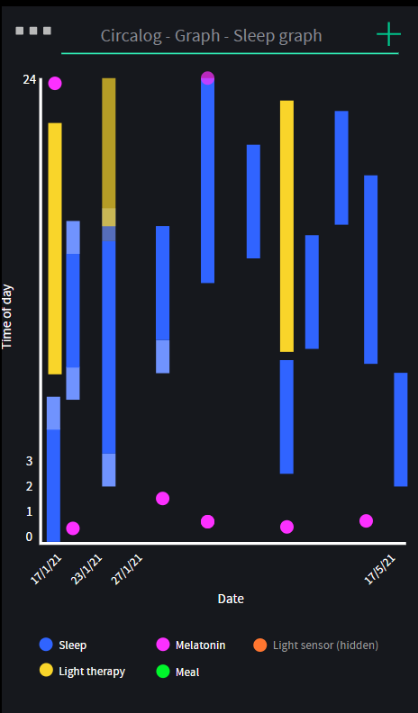

# Circalog

(WIP) An easy cross-platform logger for daily circadian/periodic events. Stop guessing, start understanding.

This app is a generalization of the concept of sleep diaries, but instead of recording just sleep periods, it can record any type of event at the simple tap of a button. Events can either be an instant point in time (eg, drug intake time), or a duration event (eg, sleep period, with a start time and end time, which requires 2 taps). It's also possible to add tags and comments to add additional informations. Databases can be exported as simple csv files, which exports not only the events log but also the configuration (eventtypes).

Aims for cross-platform support for computers (Windows, Linux, MacOS) and mobile (Android, iOS such as iPhone). Since the app will support automatic merge via unique identifiers of events and eventtypes, it's possible to use the app on multiple devices (eg, Android and Windows) and synchronize the database back and forth by exporting and importing in the app on each device.

This app is intended for both end-users (patients) and clinicians and research investigators. Indeed, the app can be preconfigured with the event types the investigator would like to monitor. Then, even if there is no logged events, the database can be exported. The investigator can then provide a link to this database through a link online (eg, Dropbox) for the study's participants or patients to import it and preconfigure their app. There's no need to worry if the user already started using the app before, as there is an auto-merge feature which will merge the imported events and eventtypes in while preserving the old ones (each event and eventtypes get a unique identifier - which is meaningless in itself but allows to merge databases).

The app will be developed with react-native and typescript. Database will likely be stored as SQLite to be cross-platforms compatible.

Circalog sleep diary format specification, intended to be generic to store a maximum of pertinent data for any kind of circadian periodic event, is readable here: https://github.com/Circadiaware/circalog/blob/main/docs/circalog-format-spec.md

An [interactive mock-up app](https://design.penpot.app/#/view/441c1550-c424-11eb-8557-f55ab9adbb41?page-id=d0e73e20-e124-11eb-a77a-195c36c76d76&index=0&share-id=1bc0a800-1ba4-11ec-9c71-4a8af25a7bed) is available on Penpot (the screenshot above is of this mock-up app). Please use Chrome based browsers preferably, as there may be [an issue](https://github.com/penpot/penpot/issues/1081) with Firefox based browser which makes the text not display correctly, although the mock-up was modified to workaround this issue. On mobiles, the default view may be too small, click on the fullscreen button at the top right corner in the Penpot interface to show the app in almost real size. Backup files for the Penpot project are available in the docs folder.

Similar projects:
* [BabyBuddy](https://github.com/babybuddy/babybuddy), opensource webapp with a native [Android app](https://github.com/babybuddy/babybuddy-for-android) with multiple time trackers, very interesting implementation very similar to circalog, but can only specify what the timer was about at the end, not at the start. Also, graphs and stats are very limited since the goal is not to track sleep disorders. On the plus sides, the app supports being used by multiple different users in different locations since it runs online, and it has an awesome history feature that shows all changes that happened. For baby sleep tracking, it is a very good app, it just needs an export feature to display sleep graphs in other apps.
* [Sleep Diary](https://sleepdiary.github.io/) by Andrew Sayers is a suite of tools and documentation to record and interpret sleep patterns. The tools are incredibly useful as they can convert between a variety of digital sleep diary formats and export clinical grade actigraphy-like graphs for grading by clinicians. The documentation is exhaustive and offers a methodology to discriminate sleep graphs into various circadian rhythm sleep disorders patterns. Circalog aim to implement a compatibility layer with these tools and also hopefully implement the methodology of Andrew Sayers to discriminate circadian rhythm disorders, alongside another novel unpublished method that will also be implemented too, the user will be able to choose.
* [Track & Graph](https://github.com/SamAmco/track-and-graph), opensource Android app to track several events durations and timings via a tapping system. Custom graphs can be setup and generated in-app. Unfortunately, it is cumbersome to use for sleep tracking since it does not record the start time and there is no daily sleep graph.
