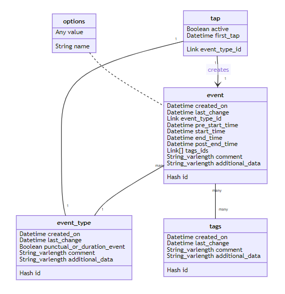
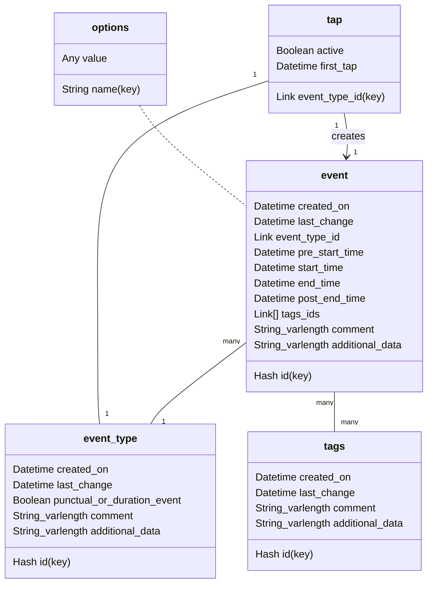

# Circalog sleep diary format specifications

The purpose of Circalog is to store any kind of circadian periodic schedule data. Hence, although the primary goal is not to define a generic data format, the data format aims to be as generalizable and agnostic as possible to be able to encode as much periodic data as possible.

Draft version: 0.5

## Fields

### Table: Events

This table stores instances of events with temporal and contextual information.

#### id

A SHA1 hash of the current datetime to ensure the id is unique. SQL key. A unique ID will allow to merge databases from different devices (eg, using Circalog on both the computer and a smartphone, one event gets added on the computer, another on the smartphone, then the computer database can be imported on the smartphone to be up to date, and inversely the smartphone database can be imported onto the computer app, so that both apps can easily be synchronized by merging databases). User cannot access this field.

#### created_on

Standard datetime format with timezone. Stores date of first creation. This is useful for statistics, as it allows the experimenter to know which records were done aposteriori or for which it was created retroactively.

#### last_change

Standard datetime format with timezone. Registers the last time the entry was modified by any action of the user. User cannot access this field. Allows to know when the entry was last updated, useful for merging databases or skip if the entry did not change.

#### event_type_id

Link to event_type's id. Defines what type of event this entry is registering. Example: sleep, eating, exercise, etc.

#### start_time

Standard datetime format with timezone. Registers when time an event started, as defined by the user's inputs. Example for sleep: this is the fall asleep time. Mandatory.

#### end_time

Standard datetime format with timezone. Registers when time an event ended, as defined by the user's inputs. Example for sleep: this is the wake up time. Mandatory if event_type.punctual_or_duration_event == true, hidden otherwise.

#### pre_start_time

Standard datetime format with timezone. Registers the time at which user started to prepare for the event, as defined by the user's inputs. Example for sleep: this is the bedtime. Optional if event_type.punctual_or_duration_event == true, hidden otherwise. The app should allow to populate this field with a default value relative to start_time (eg, 15min before start_time).

#### post_end_time

Standard datetime format with timezone. Registers the time at which user completely finished the event and transitioned to another, as defined by the user's inputs. Example for sleep: this is the stand up time (ie, getting out of bed). Optional if event_type.punctual_or_duration_event == true, hidden otherwise. The app should allow to populate this field with a default value relative to end_time (eg, 30min after end_time).

#### tags_ids

Link type, linked to tags table's id field. Stores the list of tags selected to apply to current event. Example: Melatonin, Sunlight, etc. Tags imported from other sleep diary softwares should be prefixed by the type of tag if the software has multiple tags types, for example Sleepmeter has 3 types: Aids, Hindrances, Tags. When importing from Sleepmeter, an Aids > Melatonin should become Aids_Melatonin. Prefixing can also be manually done by the user to create any number of custom categories of tags. The app can choose to display categories (as defined by prefixes) in a different manner or just display all tags in a simple vertical checkboxes list. Optional field.

#### comment

String type of variable length. Stores any textual comment the user wish to specify. Can also be used to import additional meta-data from other sleep diary apps that do not fit in other fields. Optional field.

#### additional_data

String field with variable length and a separator (default: |, example: light-`intensity=143|geo=143;12`). Stores additional meta-data from the device's sensors, such as geolocation or light sensor. Can also be used to import additional meta-data from other sleep diary apps that do not fit in other fields. Optional field, may be made uneditable depending on the app's purposes if data in this field is only automatically acquired.

### Table: event_type

This table stores all the available event types, that the user can freely modify.

#### id

A SHA1 hash of the current datetime to ensure the id is unique. SQL key. Same as for table Events, this is to allow for merging databases across devices. Another purpose is to allow for sleep clinic operators and researchers to define a list of default `event_type`s and then simply export the database as CSV, which the patients can then easily import in their Circalog app to add the new event types without overwriting their own event types and records.

#### created_on

Standard datetime format with timezone. Same as for table `events`.

#### last_change

Standard datetime format with timezone. Same as for table Events, this is to allow for merging databases across devices.

#### punctual_or_duration_event

Boolean: false = punctual, true = duration event. A punctual event only encodes a start_time, it is a single point in time. A duration event encodes both a start_time, end_time, pre_start_time and post_end_time, it represent an event that lasted for some time. Mandatory.

#### comment

String type of variable length. Stores any textual comment the user wish to specify. Can also be used to import additional meta-data from other sleep diary apps that do not fit in other fields. Optional field.

#### additional_data

String field with variable length and a separator (default: |). Stores additional data such as color for plots, or alternative labels for fields such as pre_start_time (bedtime), start_time (fall asleep time), end_time (wake up time) and post_start_time (out of bed time) to improve user experience.

### tags

Stores all tags and descriptions.

#### id

A SHA1 hash of the current datetime to ensure the id is unique. SQL key. Same as for table Events, this is to allow for merging databases across devices.

#### created_on

Standard datetime format with timezone. Same as for table `events`. Especially important for tags.

#### last_change

Standard datetime format with timezone. Same as for table `events`. Especially important for tags.

#### name

String of 256 characters (to avoid tags being too long).

#### comment

String of variable length. Additional description for the tag. Very helpful for third-parties such as sleep researchers to interpret the data generated by users.

#### additional_data

String field with variable length and a separator (default: |). Stores additional data that the user may be able to specify in the app or data from imports from other sleep diary formats that cannot fit elsewhere.

### Table: tap

This table is for a specific feature, the home dashboard buttons that show one button for each event type, ranked by frequency of use. Tapping them starts registering a new event, and tapping again mark the end of the event. This is a generalization of Sleepmeter's widget.

Events created via last_tap are only created via the homescreen tap screen. This does not inhibit the ability of users to manually create an entry, even if a tap record is undergoing.

Note: when an `event_type` entry is modified, the related entry in the `last_tap` table should be deleted, since this may not be applicable anymore due to the changes.

#### event_type_id

Link to event_type's id. SQL key. There should be no more than one entry in this table than there are event types.

#### active

Boolean. States if the event is currently being recorded (true) or not (false).

#### first_tap

Datetime with timezone standard format. Records when the first tap happened. For punctual event types, the `event` record can be created asap and this entry can be deleted (or just left there lingering). For duration event types, the `event` record will be created after the second tap and by retrieving data in this entry. It's also possible to implement a feature to cancel the entry if the second tap happens too short after the first tap, eg, 15min (this should be a user definable option).

### Table: options

This table stores the app options.

#### name

Name of the option. SQL key.

#### value

Multi types. Stores the value for the option.

## SQL relationships diagram

Relational database diagram via Mermaid:

Source code (using [Mark Text](https://marktext.app/) to display and modify interactively, [GitHub is lagging behind in implementing Mermaid](https://github.community/t/feature-request-support-mermaid-markdown-graph-diagrams-in-md-files/1922)):

