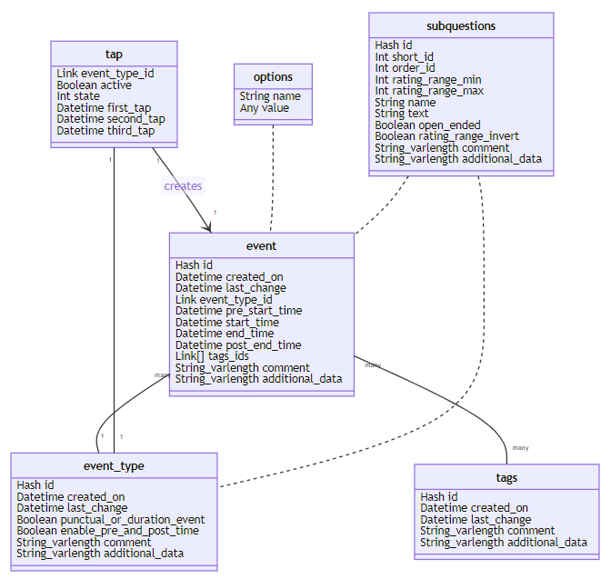
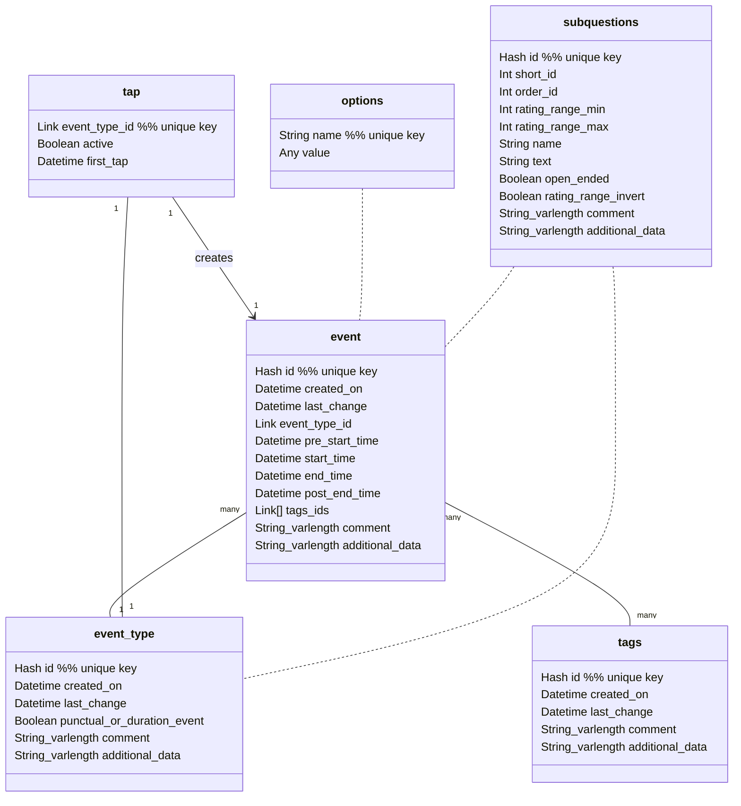

# Circalog sleep diary format specifications

The purpose of Circalog is to store any kind of circadian periodic schedule data. Hence, although the primary goal is not to define a generic data format, the data format aims to be as generalizable and agnostic as possible to be able to encode as much periodic data as possible.

The specification is intended as a working document for now, it is subject to change depending on the needs that arise during software development.

The database can be implemented in SQLite. The app should implement a native SQLite <--> CSV import/export function, to natively support not only exports/backups but also imports and merging, if possible the CSV should be a single file to ease exports and backups by non technical users (can easily be sent via e-mail).

Draft version: 0.6.1

## SQL relationships diagram

Relational database diagram via Mermaid:

Source code (use [Mark Text](https://marktext.app/) to display and modify interactively, [GitHub is lagging behind in implementing Mermaid](https://github.community/t/feature-request-support-mermaid-markdown-graph-diagrams-in-md-files/1922)):

## Fields descriptions

### Table: event

This table stores instances of events with temporal and contextual information.

Note that there is no concept of naps or duration or fragmented sleep or other secondary inferential metrics. There are two reasons: 1) they can be done at post-processing from the fields collected, so it's unnecessary to calculate them at the collection app level and clutter the database and slow down the plotting and exports processes, 2) there is no single method to accurately calculate them, different methods will produce different results, so it is best to leave that to the post-processing stage. Nevertheless, some of these secondary metrics can still be collected in the app, eg, for naps, a tag "Nap" can be created to allow the user to specify if they think this was a nap or not (although this may be very unreliable) or to import from other apps such as Sleepmeter which considers naps as a distinct type of sleep session. Fragmented sleep will just consists of several `event` records, they can be "stitched" together at post-processing time. Duration can simply be calculated using `end_time` - `start_time`, and combined with stitching, a duration over multiple fragmented but closely temporally related sleep sessions can be calculated in post-processing.

#### id

A SHA1 hash of the current datetime to ensure the id is unique. SQL key. A unique ID will allow to merge databases from different devices (eg, using Circalog on both the computer and a smartphone, one event gets added on the computer, another on the smartphone, then the computer database can be imported on the smartphone to be up to date, and inversely the smartphone database can be imported onto the computer app, so that both apps can easily be synchronized by merging databases). User cannot access this field.

#### created_on

Standard datetime format with timezone. Stores date of first creation. This is useful for statistics, as it allows the experimenter to know which records were done aposteriori or for which it was created retroactively.

#### last_change

Standard datetime format with timezone. Registers the last time the entry was modified by any action of the user. User cannot access this field. Allows to know when the entry was last updated, useful for merging databases or skip if the entry did not change.

#### event_type_id

Link to event_type's id. Defines what type of event this entry is registering. Example: sleep, eating, exercise, etc.

#### start_time

Standard datetime format with timezone. Registers when time an event started, as defined by the user's inputs. Example for sleep: this is the fall asleep time. Mandatory. For special event types such as smartphone sensors (eg, light sensor, location), start_time is automatically set to the current time and cannot be modified.

#### end_time

Standard datetime format with timezone. Registers when time an event ended, as defined by the user's inputs. Example for sleep: this is the wake up time. Mandatory if event_type.punctual_or_duration_event == true, hidden otherwise.

#### pre_start_time

Standard datetime format with timezone. Registers the time at which user started to prepare for the event, as defined by the user's inputs. Example for sleep: this is the bedtime. Optional if event_type.punctual_or_duration_event == true, hidden otherwise. The app should allow to populate this field with a default value relative to start_time (eg, 15min before start_time).

#### post_end_time

Standard datetime format with timezone. Registers the time at which user completely finished the event and transitioned to another, as defined by the user's inputs. Example for sleep: this is the stand up time (ie, getting out of bed). Optional if event_type.punctual_or_duration_event == true, hidden otherwise. The app should allow to populate this field with a default value relative to end_time (eg, 30min after end_time).

#### tags_ids

Link type, linked to tags table's id field. Stores the list of tags selected to apply to current event. Example: Melatonin, Sunlight, etc. Tags imported from other sleep diary softwares should be prefixed by the type of tag if the software has multiple tags types, for example Sleepmeter has 3 types: Aids, Hindrances, Tags. When importing from Sleepmeter, an Aids > Melatonin should become Aids_Melatonin. Prefixing can also be manually done by the user to create any number of custom categories of tags. The app can choose to display categories (as defined by prefixes) in a different manner or just display all tags in a simple vertical checkboxes list. Optional field.

#### comment

String type of variable length. Stores any textual comment the user wish to specify. Can also be used to import additional meta-data from other sleep diary apps that do not fit in other fields. Optional field.

#### additional_data

String field with variable length to store JSON formatted data. Can store additional meta-data from the device's sensors, such as geolocation or light sensor, however note that it is likely better to store sensors data in a distinct punctual event record with its own event_type, because then the start_time will be much more accurate, as the start_time of a record can be modified retroactively by the user, so it may not necessarily correspond to the time the sensor data was collected (eg, tapped sleep button at 8pm, but finally really slept at 11pm, the light sensor data corresponds to 8pm when the button was tapped but then the user modifies the start_time of the sleep session to 11pm to correspond to what happened, but the light sensor data has no timing information, it always relates to the start_time -- hence it's better to just store sensor data separately as we know for sure when the sensor data was collected). Can also be used to import additional meta-data from other sleep diary apps that do not fit in other fields. Optional field, may be made uneditable depending on the app's purposes if data in this field is only automatically acquired.

### Table: event_type

This table stores all the available event types, that the user can freely modify.

The app can implement undeletable event types for smartphone sensors by default. Recording these special events can only be at current time (non modifiable) and are of punctual type.

#### id

A SHA1 hash of the current datetime to ensure the id is unique. SQL key. Same as for table Events, this is to allow for merging databases across devices. Another purpose is to allow for sleep clinic operators and researchers to define a list of default `event_type`s and then simply export the database as CSV, which the patients can then easily import in their Circalog app to add the new event types without overwriting their own event types and records.

#### created_on

Standard datetime format with timezone. Same as for table `events`.

#### last_change

Standard datetime format with timezone. Same as for table Events, this is to allow for merging databases across devices.

#### punctual_or_duration_event

Boolean: false = punctual, true = duration event. A punctual event only encodes a start_time, it is a single point in time. A duration event encodes both a start_time, end_time, pre_start_time and post_end_time, it represent an event that lasted for some time. Mandatory.

#### comment

String type of variable length. Stores any textual comment the user wish to specify. Can also be used to import additional meta-data from other sleep diary apps that do not fit in other fields. Optional field.

#### additional_data

String field with variable length to store JSON formatted data. Stores additional data such as color for plots, or alternative labels for fields such as pre_start_time (bedtime), start_time (fall asleep time), end_time (wake up time) and post_start_time (out of bed time) and the default values (eg, pre_start_time = 15min before start_time) to improve user experience.

### tags

Stores all tags and descriptions.

#### id

A SHA1 hash of the current datetime to ensure the id is unique. SQL key. Same as for table Events, this is to allow for merging databases across devices.

#### created_on

Standard datetime format with timezone. Same as for table `events`. Especially important for tags.

#### last_change

Standard datetime format with timezone. Same as for table `events`. Especially important for tags.

#### name

String of 256 characters (to avoid tags being too long).

#### comment

String of variable length. Additional description for the tag. Very helpful for third-parties such as sleep researchers to interpret the data generated by users.

#### additional_data

String field with variable length to store JSON formatted data. Stores additional data that the user may be able to specify in the app or data from imports from other sleep diary formats that cannot fit elsewhere.

### Table: tap

This table is for a specific feature, the home dashboard buttons that show one button for each event type, ranked by frequency of use. Tapping them starts registering a new event, and tapping again mark the end of the event. This is a generalization of Sleepmeter's widget.

Events created via last_tap are only created via the homescreen tap screen. This does not inhibit the ability of users to manually create an entry, even if a tap record is undergoing.

Note: when an `event_type` entry is modified, the related entry in the `last_tap` table should be deleted, since this may not be applicable anymore due to the changes.

#### event_type_id

Link to event_type's id. SQL key. There should be no more than one entry in this table than there are event types.

#### active

Boolean. States if the event is currently being recorded (true) or not (false).

#### first_tap

Datetime with timezone standard format. Records when the first tap happened. For punctual event types, the `event` record can be created asap and this entry can be deleted (or just left there lingering). For duration event types, the `event` record will be created after the second tap and by retrieving data in this entry. It's also possible to implement a feature to cancel the entry if the second tap happens too short after the first tap, eg, 15min (this should be a user definable option).

### Table: options

This table stores the app options.

#### name

Name of the option. SQL key.

#### value

Multi types. Stores the value for the option.

#### (WIP) Table: subquestions

This table aims to allow sleep clinic operators and users to define their own set of qualitative scales, such as sleep quality, mood, etc.

These subquestions can be displayed/linked to any `event_type`. The link will be added in `event_type` as an `event_type.additional_data` field: `subquestions=1;3;5;6` where the integers are the list of the subquestions `short_id`. Then, when an `event` record is saved, the answers to subquestions will also be saved in `event.additional_data` with a similar formatting.

The app chooses how to display subquestions, either after ending an `event` record, or they can be integrated in the GUI when editing an `event` record just as if the subquestions were part of the `event` widgets (eg, like Sleepmeter's Sleep Quality widget).

#### id

Unique hash from current timestamp, to allow for easy merge.

#### short_id

Integer. Will be used to link in `subquestions`, instead of `id` which will consume much more storage space and will be humanly unreadable.

#### order_id

Integer. Will be solely used to order the appearances of subquestions.

#### name

String. Short description of the question, eg: "Sleep quality".

#### text

String of variable length. Question to display to the user, eg: "How would you rate your sleep quality?". This is optional.

#### open_ended

Boolean. If false (default), will display a slider with a range between `rating_range_min` and `rating_range_max`. If true, will display a textbox for the user to enter their thoughts freely which will be stored in the `comment` field.

#### mandatory

Boolean. If true, the user will need to fill in this subquestion to register the record. If false, the user can skip the subquestion.

#### rating_range_min

Integer. Minimum rating.

#### rating_range_max

Integer. Maximum rating. If `rating_range_max` is 1 and `rating_range_min` is 0, then the choice is binary, and 0 should be represented as "No" and 1 as "Yes".

#### rating_range_invert

Boolean. Inverts the rating range.

#### additional_data

String field with variable length to store JSON formatted data (eg: `{ rating-labels: [worst, bad, average, good, best], other-data: [data1, data2] }` ). Used to store additional data such as rating range labels (eg, instead of rating sleep quality from 0 to 10, rate as "Not at all rested", "Slightly rested", "Somewhat rested", etc as in the [Consensus Sleep Diary](https://doi.org/10.5665/sleep.1642)). Can also be used to store data from imported sleep diaries from other softwares that do not fit elsewhere.

#### comment

String of variable length. Stores either comments to complement the range rating with `open_ended == false`, or is the only thing displayed when `open_ended == true`.

### (WIP) Table: sync

This table stores links to the records in other tables that were changed since last synchronization with other devices, in order to avoid the need to transmit the full csv database dump and hence reduce data consumption and time to transfer.

This is only going to be implemented far into the future, after all other features, since synchronization will be possible de facto by manual export/import. The sync feature requires the development of a server to connect the devices. The data should be encrypted from end-to-end (E2EE), and the devices should be able to connect to each others using a QR code. There are two ways to implement the server depending on the functionalities we want:

* either the server can only serve as a connection relay for the devices to connect to each others in P2P, but then no data passes through the relay server. The advantage is that the server will use much less resources since it won't store any data, so it will be able to handle a lot more users, and can likely be hosted for free or on a low cost server. Another advantage is that it's better in terms of privacy since no private data (even encrypted ones) ever transit through the server. The disadvantage is that to synchronize devices, they need to be all connected to internet at the same time, so the synchronization cannot happen in the background, it will be an active process (ie, the user opens the synchronization tab in the app on all devices, the update is then handled automagically). This would be similar to ShareDrop.io, magic-wormhole and other similar filesharing web apps.

* either the server can store temporarily the encrypted data and relay it to other devices when they connect. This would be similar to XBrowserSync. Advantage is that devices can still synchronize even when they are not connected at the same time, and synchronization can happen in the background automatically without any user interaction. Disadvantage is that it's going to be difficult to know which device need updates (ie, do we keep the data until all devices connected at least once? But then if a device was created but then deleted or never used again such as eg, an old phone, the data will stay forever on the server), and more importantly that the server will need to have storage space, so it will be much more costly to host and will scale much more poorly with a greater number of users, although databases are usually pretty small (and we can cap a limit just like XBrowserSync, professional users can self-host the open-source server).

#### table_name

String of the name of the table of the modified/created record.

#### id

Unique id of the modified/created record since last sync.

When syncing, the app can use `table_name` and `id` to build a subset of records that are new/modified by fetching the records from the referenced table and id, and then send a reduced CSV export of just this subset of records.

## Other standard sleep diary specifications

* [Consensus Sleep Diary](https://doi.org/10.5665/sleep.1642). If possible, Circalog should be a superset, and allow implementation of all 3 variants of the Consensus Sleep Diary.

* [Andrew Sayers' standard sleep diary format draft](https://github.com/andrew-sayers/sleep-diary-formats/tree/main/src/Standard), with the goal of supporting imports from all major electronic sleep diary formats and provide baseline functionalities.
