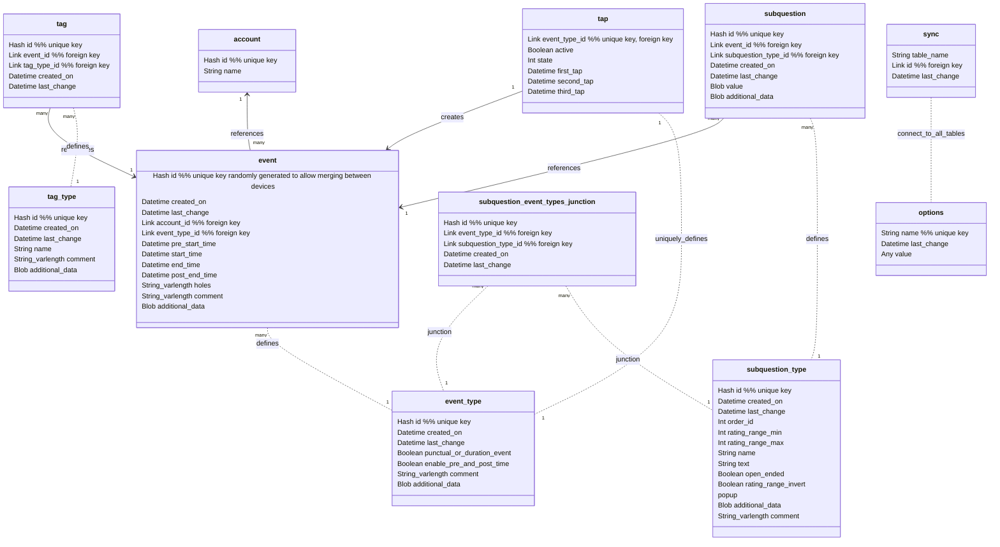

# Circalog sleep diary format specifications

The purpose of Circalog is to store any kind of circadian periodic schedule data. Hence, although the primary goal is not to define a generic data format, the data format aims to be as generalizable and agnostic as possible to be able to encode as much periodic data as possible.

The specification is intended as a working document for now, it is subject to change depending on the needs that arise during software development.

The database can be implemented in SQLite. The app should implement a native SQLite import/export/merge function, to natively support not only exports/backups but also imports and merging using a standard file format that is easy to load for post-processing data analysis. The export should be in a single file if possible, to ease exports and backups by non technical users (can easily be sent via e-mail). In the future, import/export in CSV or JSON may be possible but is not a priority. However, import from Sleepmeter CSV file format will be implemented.

Draft version: 0.7.3

## SQL relationships diagram

Relational database diagram via Mermaid:

Source code (use [Mark Text](https://marktext.app/) to display and modify interactively, [GitHub is lagging behind in implementing Mermaid](https://github.community/t/feature-request-support-mermaid-markdown-graph-diagrams-in-md-files/1922), use [Mermaid Live Editor](https://mermaid.live/edit) online to generate a SVG):

## Design choices

The number of columns should be kept at the minimal amount required to store valuable, non replaceable, non cosmetic information.

Hence, all cosmetic information or parameters, such as subquestions labels, are saved in an `additional_fields` column, present in all tables to store both cosmetic information but also data that may be imported from other sleep diary programs that cannot be imported in another column, so as to not lose data when importing from different sleep diary file specifications.

## Fields descriptions

### Table: event

This table stores instances of events with temporal and contextual information.

Note that there is no concept of naps or duration or fragmented sleep or other secondary inferential metrics. There are two reasons: 1) they can be done at post-processing from the fields collected, so it's unnecessary to calculate them at the collection app level and clutter the database and slow down the plotting and exports processes, 2) there is no single method to accurately calculate them, different methods will produce different results, so it is best to leave that to the post-processing stage. Nevertheless, some of these secondary metrics can still be collected in the app, eg, for naps, a tag "Nap" can be created to allow the user to specify if they think this was a nap or not (although this may be very unreliable) or to import from other apps such as Sleepmeter which considers naps as a distinct type of sleep session. Fragmented sleep will just consists of several `event` records, they can be "stitched" together at post-processing time. Duration can simply be calculated using `end_time` - `start_time`, and combined with stitching, a duration over multiple fragmented but closely temporally related sleep sessions can be calculated in post-processing.

#### id

A SHA1 hash of the current datetime to ensure the id is unique. SQL key. A unique ID will allow to merge databases from different devices (eg, using Circalog on both the computer and a smartphone, one event gets added on the computer, another on the smartphone, then the computer database can be imported on the smartphone to be up to date, and inversely the smartphone database can be imported onto the computer app, so that both apps can easily be synchronized by merging databases). User cannot access this field.

#### created_on

Standard datetime format with timezone. Stores date of first creation. This is useful for statistics, as it allows the experimenter to know which records were done aposteriori or for which it was created retroactively.

#### last_change

Standard datetime format with timezone. Registers the last time the entry was modified by any action of the user. User cannot access this field. Allows to know when the entry was last updated, useful for merging databases or skip if the entry did not change.

#### account_id

Foreign key linking to `account`'s id. This allows to manage multiple sleep diaries for multiple individuals in the same household using the same app, without having to export the database to save it, delete the current database and load another one or start afresh everytime the user wants to switch, or to use multiple devices with only one account per device. This is a common use case since circadian rhythm disorders are often inherited, so that it is not uncommon for both a parent and at least one child to share a similar circadian rhythm and hence the same need to document their sleep patterns.

#### event_type_id

Foreign key linking to `event_type`'s id. Defines what type of event this entry is registering. Example: sleep, eating, exercise, etc.

#### start_time

Standard datetime format with timezone. Registers when time an event started, as defined by the user's inputs. Example for sleep: this is the fall asleep time. Mandatory. For special event types such as smartphone sensors (eg, light sensor, location), start_time is automatically set to the current time and cannot be modified.

#### end_time

Standard datetime format with timezone. Registers when time an event ended, as defined by the user's inputs. Example for sleep: this is the wake up time. Mandatory if event_type.punctual_or_duration_event == true, hidden otherwise.

#### pre_start_time

Standard datetime format with timezone. Registers the time at which user started to prepare for the event, as defined by the user's inputs. Example for sleep: this is the bedtime. Optional if event_type.punctual_or_duration_event == true, hidden otherwise. The app should allow to populate this field with a default value relative to start_time (eg, 15min before start_time).

#### post_end_time

Standard datetime format with timezone. Registers the time at which user completely finished the event and transitioned to another, as defined by the user's inputs. Example for sleep: this is the stand up time (ie, getting out of bed). Optional if event_type.punctual_or_duration_event == true, hidden otherwise. The app should allow to populate this field with a default value relative to end_time (eg, 30min after end_time).

#### holes

String type of variable length, to store holes data: start from start_time (in minutes), duration (in minutes), and whether the hole was generated by tapping or manually created (true/false). Example: 10,30,1|60,5,0 represents two holes, the first starting 10min from the event's start_time and lasting 30min and was recorded by tapping (both start and end), after the pipe a second hole is represented at 1h past start_time, lasting for 5min and recorded manually (by the user opening the app and clicking on the Plus button without using tapping homescreen buttons). This will require a conversion from Sleepmeter's format, which represents the start and end of the hole relative to start_time, instead of start and duration of holes as done here.

Holes are very important to increase the accuracy of the sleep diary, of sleep fragmentation and of sleep duration, and it's much more convenient than linked sessions which is rather geared towards siestas or sleep sessions with a wide hole, but not lots of tiny holes. Also, it's easier to estimate the duration of a hole (eg, the user remembers waking up for about 10 minutes) than the exact timing when it happened ; actigraphy is better indicated for this purpose, but the goal here is to at least know there were fragmentations, not necessarily their exact timing, and it should be very easy for the user to input holes durations, regardless of the exact timing - to do so, Sleepmeter offers automatically dynamically guesstimated start and end times for manually added holes, but with more than 2 holes then it fails because it can only add holes after the previous ones, so we have to retime all the previous ones, 3 possible solutions for that: 1- we could allow the user to input holes durations without a start time for holes, the start time being optional (not the event's start_time, but the hole's!), 2- automatically reorder in chronological order the holes on save, so that the user does not have to manually modify each previously generated hole to add a new one that happened earlier than the others, 3- add an optional button to generate multiple holes uniformly spaced. We will likely implement solutions 1 and 2, they are the most elegant and flexible.

#### comment

String type of variable length. Stores any textual comment the user wish to specify. Can also be used to import additional meta-data from other sleep diary apps that do not fit in other fields. Optional field.

#### additional_data

Blob field with variable length to store JSON formatted data. Can store additional meta-data from the device's sensors, such as geolocation or light sensor, however note that it is likely better to store sensors data in a distinct punctual event record with its own event_type, because then the start_time will be much more accurate, as the start_time of a record can be modified retroactively by the user, so it may not necessarily correspond to the time the sensor data was collected (eg, tapped sleep button at 8pm, but finally really slept at 11pm, the light sensor data corresponds to 8pm when the button was tapped but then the user modifies the start_time of the sleep session to 11pm to correspond to what happened, but the light sensor data has no timing information, it always relates to the start_time -- hence it's better to just store sensor data separately as we know for sure when the sensor data was collected). Can also be used to import additional meta-data from other sleep diary apps that do not fit in other fields. Optional field, may be made uneditable depending on the app's purposes if data in this field is only automatically acquired.

Should also store a `tapping` and `manually_modified_times` metadata field, a boolean to signify if the event's `start_time` and `end_time` were initially generated via tapping, and whether they were modified after being generated by tapping, respectively. This will allow analysts to filter records based on whether they were generated retrospectively (manually by user, more prone to human memory errors) or prospectively (by tapping when the event happens, less prone to human memory error, hence arguably more accurate).

### Table: event_type

This table stores all the available event types, that the user can freely modify.

The app can implement undeletable event types for smartphone sensors by default. Recording these special events can only be at current time (non modifiable) and are of punctual type.

#### id

A SHA1 hash of the current datetime to ensure the id is unique. SQL key. Same as for table Events, this is to allow for merging databases across devices. Another purpose is to allow for sleep clinic operators and researchers to define a list of default `event_type`s and then simply export the database as CSV, which the patients can then easily import in their Circalog app to add the new event types without overwriting their own event types and records.

#### created_on

Standard datetime format with timezone. Same as for table `events`.

#### last_change

Standard datetime format with timezone. Same as for table Events, this is to allow for merging databases across devices.

#### punctual_or_duration_event

Boolean: false = punctual, true = duration event. A punctual event only encodes a start_time, it is a single point in time. A duration event encodes both a start_time, end_time, pre_start_time and post_end_time, it represent an event that lasted for some time. Mandatory.

#### enable_pre_and_post_time

Boolean: false = only `start_time` and `end_time` will be displayed, true = `pre_start_time` and `post_start_time` will be displayed too. Tap buttons will also enable additional features such as holding to start recording the `pre_start_time`.

#### comment

String type of variable length. Stores any textual comment the user wish to specify. Can also be used to import additional meta-data from other sleep diary apps that do not fit in other fields. Optional field.

#### additional_data

Blob field with variable length to store JSON formatted data. Stores additional data such as color for plots, or alternative labels for fields such as pre_start_time (bedtime), start_time (fall asleep time), end_time (wake up time) and post_start_time (out of bed time) and the default values (eg, pre_start_time = 15min before start_time) to improve user experience.

### Table: tag_type

Stores all tags types and their descriptions.

#### id

A SHA1 hash of the current datetime to ensure the id is unique. SQL key. Same as for table Events, this is to allow for merging databases across devices.

#### created_on

Standard datetime format with timezone. Same as for table `events`. Especially important for tags.

#### last_change

Standard datetime format with timezone. Same as for table `events`. Especially important for tags.

#### name

String of 256 characters (to avoid tags being too long).

#### comment

String of variable length. Additional description for the tag. Very helpful for third-parties such as sleep researchers to interpret the data generated by users.

#### additional_data

Blob field with variable length to store JSON formatted data. Stores additional data that the user may be able to specify in the app or data from imports from other sleep diary formats that cannot fit elsewhere.

For tags, this could store an option "milestone", which would describe if the tag should be displayed as a whole-day  start or end of a milestone (ie, a vertical line in the sleep graph to delimit the period before the milestone and after).

### Table: tag

Junction table to create a many-to-many connection between `event`s and `tag_type`s. Stores all selected tags for a given `event`.

#### id

Unique SHA1 hash id.

#### event_id

Foreign key linking to `event`'s id. Hence, `event`s do not store tags directly, it's the `tag` table that references `event`s.

#### tag_type_id

Foreign key linking to `tag_type`'s id.

#### created_on

Standard UTC datetime.

#### last_change

Standard UTC datetime.

### Table: tap

This table is for a specific feature, the home dashboard buttons that show one button for each event type, ranked by frequency of use. Tapping them starts registering a new event, and tapping again mark the end of the event. This is a generalization of Sleepmeter's widget.

Events created via last_tap are only created via the homescreen tap screen. This does not inhibit the ability of users to manually create an entry, even if a tap record is undergoing.

Note: when an `event_type` entry is modified, the related entry in the `last_tap` table should be deleted, since this may not be applicable anymore due to the changes.

#### event_type_id

Foreign key linking to `event_type`'s id. SQL key. There should be no more than one entry in this table than there are event types.

#### active

Boolean. States if the event is currently being recorded (true) or not (false).

#### state

Integer. Counts the tap stage so far. Can be decremented if a tap happens during the global option `cancel_interval` (eg, tap to start recording, then tap again under 15min, this will cancel the recording, and decrement this counter). Cancelling only works for duration event types, for punctual events these can be deleted manually by the user in the History tab.

#### first_tap

Datetime with timezone standard format. Records when the first tap happened. For punctual event types, the `event` record can be created asap without even creating an entry here. For duration event types, the `event` record will be created after the second tap (or fourth tap if `enable_pre_and_post_time == true`) and by retrieving data in this entry. It's also possible to implement a feature to cancel the entry using a global option `cancel_interval` if the second tap happens too short after the first tap, eg, 15min (this should be a user definable option).

#### second_tap

Datetime with timezone standard format. Records when the second tap happened. This is only used when the `event_type` has a `enable_pre_and_post_time == true`.

#### third_tap

Datetime with timezone standard format. Records when the third tap happened. This is only used when the `event_type` has a `enable_pre_and_post_time == true`.

### Table: account

This table stores the multiple accounts for one same device. They all get exported in a single file, and accounts can be merged in the same device from different devices, since they all have a unique id generated at creation.  This allows for multiple individuals in the same household to write their sleep diaries using the same app, such as a parent and their child. All accounts share the same `event_type`s, `subquestions` and global `options`, the only difference is in `event`s where the `account_id` will allow to know which event belongs to which account. The assumption is that multiple accounts will be used by people in the same household, with likely similar needs due to inheritance of the circadian rhythm.

#### id

A SHA1 hash of the current datetime to ensure the id is unique. SQL key. Same as for table Events, this is to allow for merging databases across devices.

#### name

String representing the name that will be displayed on screen to refer to this account.

### Table: options

This table stores the app global options, such as `cancel_interval`.

#### name

Name of the option. SQL key. The name can be translated using language files outside of the SQL database, using the `option.name` as a key to find the translation.

#### value

Multi types. Stores the value for the option.

#### description

String of variable length. Describes what the field is about. This could also be stored in language files instead of the SQL database, by using placeholders such as `{option-name-description}`.

#### tooltip

String of variable length. More help about the field's purpose. This could also be stored in language files instead of the SQL database, by using placeholders such as `{option-name-tooltip}`.

#### Table: subquestion_type

This table aims to allow sleep clinic operators and users to define their own set of qualitative scales, such as sleep quality, mood, etc.

These subquestions can be displayed/linked to any `event_type` with a many-to-many connection thanks to the `subquestion` table and the `subquestion_event_types_junction` junction table.

The app chooses how to display subquestions integrated in the GUI when editing an `event` record just as if the subquestions were part of the `event` widgets (eg, like Sleepmeter's Sleep Quality widget -- see the mock-up app for Circalog too on bright light therapy, there is a "Mood widget" that represents a subquestion).

#### id

Unique hash from current timestamp, to allow for easy merge.

#### order_id

Integer. Will be solely used to order the appearances of subquestions.

#### name

String. Short description of the question, eg: "Sleep quality".

#### text

String of variable length. Question to display to the user, eg: "How would you rate your sleep quality?". This is optional.

#### open_ended

Boolean. If false (default), will display a slider with a range between `rating_range_min` and `rating_range_max`. If true, will display a textbox for the user to enter their thoughts freely which will be stored in the `comment` field.

#### mandatory

Boolean. If true, the user will need to fill in this subquestion to register the record. If false, the user can skip the subquestion.

#### rating_range_min

Integer. Minimum rating.

#### rating_range_max

Integer. Maximum rating. If `rating_range_max` is 1 and `rating_range_min` is 0, then the choice is binary, and 0 should be represented as "No" and 1 as "Yes".

#### rating_range_invert

Boolean. Inverts the rating range.

#### popup

Integer. Allows to select between 3 options:

* 0: do not show any pop-up, the user must manually open an `event` entry to answer this subquestion type.

* 1: show a popup with the question to answer when tapping to start the recording (eg, when going to bed).

* 2: show a popup when tapping to end the recording (eg, when waking up).

* 3: show a popup when tapping to start the next recording of the same `event_type` (eg, when going to bed the next night, a question to ask "How did you feel today?" will popup and the answer will be recorded on the previous night's `event` record -- in other words this allows to record delayed subquestions answers).

#### additional_data

Blob field with variable length to store JSON formatted data (eg: `{ rating-labels: [worst, bad, average, good, best], other-data: [data1, data2] }` ). Used to store additional data such as rating range labels (eg, instead of rating sleep quality from 0 to 10, rate as "Not at all rested", "Slightly rested", "Somewhat rested", etc as in the [Consensus Sleep Diary](https://doi.org/10.5665/sleep.1642)). Can also be used to store data from imported sleep diaries from other softwares that do not fit elsewhere.

### Table: subquestion

Stores the user's responses to the subquestions. They link directly to the `event`'s id, so that it is easy to filter or search events based on a target `subquestion`'s value.

#### id

Unique SHA1 hash.

#### event_id

Foreign key linking to the `event`'s id.

#### subquestion_type_id

Foreign key linking to the `subquestion_type`'s id.

#### created_on

Standard UTC datetime.

#### last_change

Standard UTC datetime.

#### value

Blob data field storing the user's response to the subquestion.

#### comment

String of variable length. Stores either comments to complement the range rating with `subquestion_type.open_ended == false`, or is the only thing displayed when `open_ended == true`.

#### additional_data

Blob data field storing additional metadata or data imported from other softwares that would not fit anywhere else.

### Table: subquestion_event_types_junction

Junction table to allow for a many-to-many connection between `subquestion_type` and `event_type` tables, so that one `subquestion_type` can be assigned to multiple `event_type`s (eg, generic questions such as "How are you feeling?" can be applied to pretty much any type of event if the experimenter wishes so), and one `event_type` can have multiple `subquestion_type` s. This is the table that will be joined when loading an event in the GUI to know which subquestions we need to display.

#### id

Unique SHA1 id.

#### event_type_id

Foreign key linking to the `event_type`'s id.

#### subquestion_type_id

Foreign key linking to the `subquestion_type`'s id.

#### created_on

Standard UTC datetime.

#### last_change

Standard UTC datetime

### Table: sync

This table stores links to the records in other tables that were changed since last synchronization with other devices, in order to avoid the need to transmit the full csv database dump and hence reduce data consumption and time to transfer.

This is only going to be implemented far into the future, after all other features, since synchronization will be possible de facto by manual export/import. The sync feature requires the development of a server to connect the devices. The data should be encrypted from end-to-end (E2EE), and the devices should be able to connect to each others using a QR code. There are two ways to implement the server depending on the functionalities we want:

* either the server can only serve as a connection relay for the devices to connect to each others in P2P, but then no data passes through the relay server. The advantage is that the server will use much less resources since it won't store any data, so it will be able to handle a lot more users, and can likely be hosted for free or on a low cost server. Another advantage is that it's better in terms of privacy since no private data (even encrypted ones) ever transit through the server. The disadvantage is that to synchronize devices, they need to be all connected to internet at the same time, so the synchronization cannot happen in the background, it will be an active process (ie, the user opens the synchronization tab in the app on all devices, the update is then handled automagically). This would be similar to ShareDrop.io, magic-wormhole and other similar filesharing web apps.

* either the server can store temporarily the encrypted data and relay it to other devices when they connect. This would be similar to XBrowserSync. Advantage is that devices can still synchronize even when they are not connected at the same time, and synchronization can happen in the background automatically without any user interaction. Disadvantage is that it's going to be difficult to know which device need updates (ie, do we keep the data until all devices connected at least once? But then if a device was created but then deleted or never used again such as eg, an old phone, the data will stay forever on the server), and more importantly that the server will need to have storage space, so it will be much more costly to host and will scale much more poorly with a greater number of users, although databases are usually pretty small (and we can cap a limit just like XBrowserSync, professional users can self-host the open-source server).

#### table_name

String of the name of the table of the modified/created record.

#### id

Unique id of the modified/created record since last sync (foreign key with cascading deletion).

When syncing, the app can use `table_name` and `id` to build a subset of records that are new/modified by fetching the records from the referenced table and id, and then send a reduced CSV export of just this subset of records.

#### last_change

Standard UTC datetime format. Serves as a merge conflicts detector. In case the same record is modified on two different devices, this will allow to present the user with a list of records that cannot be merged automatically, so they will have to check themselves (we could later add a wizard to help them choose which record is the good one but it's going to be complicated so for now this is not on the roadmap, but at least we need to be able to detect conflicts).

## Side notes

* A timestamp field was considered as it would be easier to process to plot non-24h graphs, but the issue is that we would need to duplicate ALL datetime fields into timestamp fields. Or we could replace datetime fields with timestamp fields, but this is unsatisfactory as then timestamp fields would have to be systematically preprocessed before any datetime widget display or 24h datetime text (which will remain the standard as it is more easily understood by users). Hence, the decision was taken to keep all temporal fields in a UTC datetime format, they will need to be preprocessed only for non-24h graphs (ie, with days/axis longer than 24h), as UTC datetime format can easily be converted back and forth from and to timestamp format.

* Several datatypes described here are not available in sqlite3, but they are much more descriptive of the intent. Here is a [list of datatypes in sqlite3](https://www.sqlite.org/datatype3.html). Here are how the datatypes should be converted:
  
  * Hash --> Blob
  
  * Datetime --> Text in ISO8601
  
  * Link[] --> [Foreign key](https://www.sqlitetutorial.net/sqlite-foreign-key/), blob datatype
  
  * String --> Text
  
  * Boolean --> Integer
  
  * Int --> Integer
  
  * Any --> Blob
  
  * Keep in mind Column Affinity can be used advantageously to still define a more specific type although it will transparently get converted (eg, Boolean will get converted to Integer but at least the table creation statement will make the intent clear).
  
  * Note that **using Forein keys is crucial, especially with cascading on deletion and modification**, as this will allow to automatically take care of pruning or updating downstream entries in other tables.

* There are several junction tables. In the past, the model was aimed to be simpler, without junction tables, but this led to several limitations, such as the inability to assign multiple subquestion types to multiple event types. Another major issue was that searching and filtering through metadata such as tags or subquestions responses was difficult and unoptimized. With junction tables, it's [a simple SQL query](https://stackoverflow.com/a/13970688) that can be automatically optimized by the relational engine. Furthermore, the SQL will automatically manage edge cases such as cascading deletion thanks to foreign keys. So the schema is a bit more complicated, but much more simpler to use and program. However, due to the complexity, exports will likely be mainly in sqlite format, not CSV anymore, but this will also ease post-processing as linking fields between tables will be much easier through SQL with data processing libraries than with CSV which requires text manipulations (and which can often get mangled due to encoding issues...), since sqlite is a binary format.

* There needs to be an option to reset the database of events, subquestions and tags records, but not types. This will be very useful for experimenters, so they can reuse the same device over and over again with multiple patients, very quickly by just erasing the records but not the configuration.

## Other standard sleep diary specifications

* [Consensus Sleep Diary](https://doi.org/10.5665/sleep.1642). If possible, Circalog should be a superset, and allow implementation of all 3 variants of the Consensus Sleep Diary.

* [Andrew Sayers' standard sleep diary format draft](https://github.com/andrew-sayers/sleep-diary-formats/tree/main/src/Standard), with the goal of supporting imports from all major electronic sleep diary formats and provide baseline functionalities.
